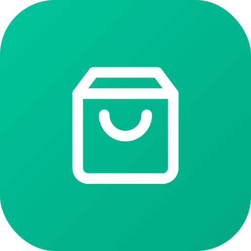
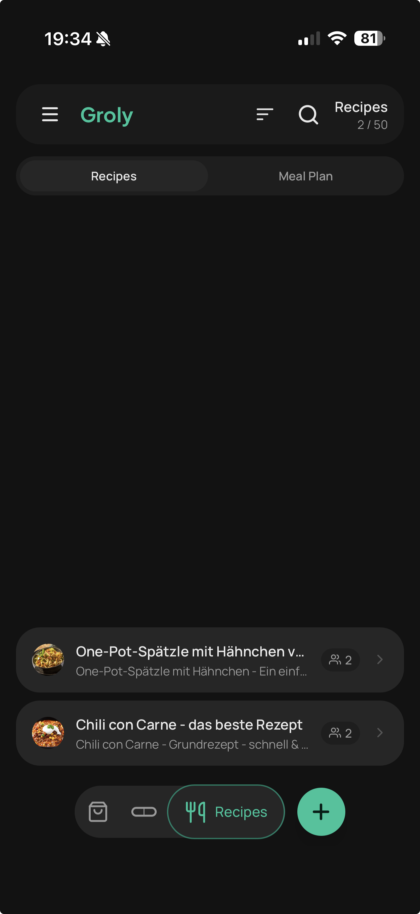

# Groly

<p align="center">
  
</p>

A mobile-first **grocery list, supplement tracker, and meal planner** built for self-hosting — designed for your phone, not adapted to it. Every interaction is touch-optimized: bottom navigation, large tap targets, swipe gestures, and offline support so it works without signal in the store. Also fully usable in a desktop browser.

Groly is a **PWA (Progressive Web App)**. Install it to your home screen on iOS or Android to unlock the full experience: offline mode, push notifications, barcode scanner, and location-based list opening all require the installed PWA.

Self-hosted, runs as a lightweight Docker container. Ready for **Unraid** and any other Docker-based home server setup. Designed for families and small teams — no open registration, users are invited by the admin.

## Features

### Shopping Lists

<p align="center">
  
  
  
</p>

- **Shared lists** – Share lists with other users; changes sync in real time via Server-Sent Events.
- **Offline-first** – Add, check off, edit, and delete items without internet. Changes sync automatically when back online.
- **Barcode scan** – Scan product barcodes with your camera to add items directly to your list (iOS and Android). Uses the native [BarcodeDetector API](https://developer.mozilla.org/en-US/docs/Web/API/BarcodeDetector) where available (Chrome/Android) with [ZBar WASM](https://github.com/undecaf/zbar-wasm) as a fallback for iOS and Firefox. Product names are looked up via [Open Food Facts](https://world.openfoodfacts.org/), [Open Products Facts](https://world.openproductsfacts.org/), and [Open Beauty Facts](https://world.openbeautyfacts.org/) — open, community-maintained product databases covering food, household, and personal care items. No API key required. Lookups are routed through your server (user IPs are not exposed) and cached persistently in SQLite. An offline indicator is shown in the scanner when there is no internet connection.
- **Category sorting** – Items are automatically assigned a category based on keyword matching (e.g. "milk" → Dairy, "apple" → Fruit & Vegetables). The display order of categories can be customized in Settings to match your supermarket layout — globally or individually per list. Users can also override the category of any single item.
- **Smart suggestions** – When adding items, previously used item names are suggested. Suggestions are tracked per user in a dedicated history table and ranked by usage frequency. Checked-off items older than 60 days are automatically removed from the database; suggestion history is retained for 6 months after last use.
- **Swipe to peek** – Swipe left or right on any item tile whose name is truncated to reveal the full name in an overlay, without accidentally checking it off.
- **Favourites** – Long-press an item and tap the star next to the quantity field to save it as a favourite. Favourited items are marked with a small green dot on their tile (can be turned off in Settings → Display). Open the favourites panel via + → Favourites to quickly re-add them to any list, sorted by category. Long-press a favourite card to remove it.

### Supplement Tracker

<p align="center">
  
  
  
</p>
<p align="center">
  
  
</p>

- **Log supplements** – Track daily intake with a quick-log sheet. Adjust amounts, set the time, and confirm with one tap.
- **Nutrient tracking** – Define nutrients per unit for each supplement (e.g. 500 mcg Vitamin B12 per capsule). Groly automatically sums up your total daily nutrient intake across all supplements.
- **Stock tracking** – Track stock levels per supplement. Reorder directly via the built-in shopping cart button, which adds the supplement to any of your lists.
- **Push reminders** – Set configurable daily reminder times per supplement. Delivered via push notification to your phone.
- **History** – Day, week, and month views for both supplements taken and nutrients consumed. Navigate back in time to review any period.
- **Active/inactive toggle** – Temporarily disable a supplement without deleting it or its history.
- **Brand & info** – Optionally store brand and additional information per supplement.

### Recipes & Meal Planning

<p align="center">
  
  
</p>

- **Recipes** – Create and manage recipes, scale servings, and add ingredients directly to a shopping list. Import recipes from popular recipe websites by URL.
- **Weekly meal planner** – Plan meals for every day of the week. Assign recipes or free-text entries per day, adjust servings, and add ingredients from individual days or the entire week directly to a shopping list. Navigate forwards and backwards by week. Configurable as a quick access shortcut.

### Settings & Customization

<p align="center">
  
</p>

- **Feature flags** – Supplements and Recipes can be independently enabled or disabled per user in Settings → Display. Hide sections you don't use — they disappear from the navigation entirely.
- **Category sorting** – Customize the display order of categories globally or per list, to match your supermarket layout.
- **Quick access shortcuts** – Configure up to 4 shortcuts accessible by long-pressing the + button.
- **Favourite indicator** – The green dot on favourited items can be turned off per user.

### Notifications & Location

- **Push notifications** – Get notified when someone adds an item to a shared list, when a new app version is available, and for supplement reminders. Works on iOS (16.4+) and Android.
- **Location-based list opening** – Assign a location to any list (e.g. your supermarket). When you arrive within 100 meters, Groly automatically opens that list — no tapping required. Opt-in per user in Settings.

### Quick Access

- **Quick access shortcuts** – Long-press the + button to reveal up to 4 configurable shortcuts. Slide your finger to the desired shortcut and release to navigate — or release over empty space to cancel. Each shortcut can open a list, open a list with the add-item dialog, or jump straight into the barcode scanner. Configurable per user in Settings and synced across devices.

### App & Platform

<p align="center">
  
</p>

- **PWA** – Installable on iOS and Android, works like a native app.
- **Light & Dark mode** – Follows system preference automatically.
- **Multi-user** – Admin creates users, resets passwords, and manages sharing invitations.
- **In-app changelog** – A "What's New" modal appears after each update and is always accessible from the menu.
- **i18n** – German and English.

## User Management

Groly does not have open registration — the admin creates accounts manually. This is by design for self-hosted instances where you control who has access.

**Adding users:**
1. Log in as admin
2. Open the menu (☰, top right)
3. Go to **Users**
4. Tap **Add User**

Only admin accounts can create users, reset passwords, and manage list sharing invitations. A newly created user is prompted to change their password on first login.

## HTTPS

**HTTPS is required.** Without it, the following features will not work:

| Feature | Why HTTPS is needed |
|---------|-------------------|
| **Offline mode** | Service workers only register over HTTPS (browser requirement) |
| **PWA installation** | Browsers only allow "Add to Home Screen" over HTTPS |
| **Push notifications** | The Web Push API is restricted to HTTPS |
| **Barcode scanner** | Camera access (`getUserMedia`) requires HTTPS |
| **Session cookies** | The session cookie uses the `Secure` flag in production |

### Getting HTTPS without a public domain

If you want to run Groly on your home network without exposing it to the internet, you have a few good options:

#### Reverse Proxy
Run Groly behind Nginx Proxy Manager, Caddy, or Traefik with a real domain and Let's Encrypt. Works well if your server is already reachable from the internet.

#### Tailscale
Tailscale gives every device a real hostname with a valid Let's Encrypt certificate — no public DNS or port forwarding needed. Free for up to 100 devices.
1. Install Tailscale on your Unraid server (available as a Community Applications plugin)
2. Enable HTTPS: Tailscale Admin → DNS → Enable HTTPS
3. Set `ORIGIN` to your Tailscale hostname, e.g. `https://my-server.tail-xxxxx.ts.net`

#### Cloudflare Tunnel
Zero-config HTTPS tunnel to your server, no port forwarding required. Free tier available.

## Docker Deployment

The image is published to GitHub Container Registry and can be pulled directly:

```
ghcr.io/peterthepeter/groly:latest
```

### Docker Compose

```yaml
services:
  groly:
    image: ghcr.io/peterthepeter/groly:latest
    ports:
      - "3000:3000"
    volumes:
      - /mnt/user/appdata/groly:/app/data
    environment:
      - ADMIN_USERNAME=your-username
      - ADMIN_PASSWORD=secure-password
      - ORIGIN=https://your-domain.com
      - ADDRESS_HEADER=X-Forwarded-For  # required when running behind a reverse proxy
      # Optional: push notifications (see Push Notifications section below)
      # - VAPID_PUBLIC_KEY=<publicKey>
      # - VAPID_PRIVATE_KEY=<privateKey>
      # - PUBLIC_VAPID_PUBLIC_KEY=<same publicKey>
      # - VAPID_SUBJECT=https://your-domain.com
    restart: unless-stopped
```

### Unraid

Install via **Community Applications** (search for "Groly") or add the template manually:

- **Template URL:** `https://raw.githubusercontent.com/peterthepeter/groly/main/unraid/groly.xml`
- **Repository:** `ghcr.io/peterthepeter/groly:latest`
- **Port:** `3000` (WebUI)
- **Path:** `/app/data` → e.g. `/mnt/user/appdata/groly`
- **Variables:** `ADMIN_USERNAME`, `ADMIN_PASSWORD`, `ORIGIN`
- **Push notifications (optional):** additionally set `VAPID_PUBLIC_KEY`, `VAPID_PRIVATE_KEY`, `PUBLIC_VAPID_PUBLIC_KEY`, `VAPID_SUBJECT` — see [Push Notifications](#push-notifications-optional) below

The volume `/app/data` contains the SQLite database. An admin user is created on first start and is prompted to change the password on first login.

> **File permissions:** The container runs as user `groly` (UID 1000, GID 1000). Make sure the host data directory is owned by this user:
> ```bash
> chown -R 1000:1000 /path/to/your/appdata/groly
> ```
> Existing installations upgrading from an older version must run this command once before restarting the container.

> **Architecture:** The Docker image is built for `linux/amd64`.

### Environment Variables

| Variable | Required | Description |
|----------|----------|-------------|
| `DATABASE_URL` | Yes | Path to the SQLite file, e.g. `/app/data/groly.db` |
| `ORIGIN` | Yes | Full URL of your instance, e.g. `https://groly.example.com` |
| `ADMIN_USERNAME` | First run only | Username for the initial admin account |
| `ADMIN_PASSWORD` | First run only | Password for the initial admin account |
| `VAPID_PUBLIC_KEY` | Optional | VAPID public key for push notifications |
| `VAPID_PRIVATE_KEY` | Optional | VAPID private key for push notifications |
| `PUBLIC_VAPID_PUBLIC_KEY` | Optional | Same value as `VAPID_PUBLIC_KEY` |
| `VAPID_SUBJECT` | Optional | `https://` URL or `mailto:` address for VAPID |
| `ADDRESS_HEADER` | Behind proxy | Set to `X-Forwarded-For` when running behind a reverse proxy (Caddy, Nginx, Traefik). Required for login rate limiting to work per client IP instead of per proxy IP. |

### Push Notifications (optional)

Generate a VAPID key pair once:

```sh
node -e "const wp=require('web-push'); const k=wp.generateVAPIDKeys(); console.log(JSON.stringify(k,null,2))"
```

Add to your environment:

```yaml
environment:
  - VAPID_PUBLIC_KEY=<publicKey>
  - VAPID_PRIVATE_KEY=<privateKey>
  - PUBLIC_VAPID_PUBLIC_KEY=<same publicKey>
  - VAPID_SUBJECT=https://your-domain.com
```

**Important:**
- `VAPID_PUBLIC_KEY` and `PUBLIC_VAPID_PUBLIC_KEY` must be the **same value**.
- `VAPID_SUBJECT` must be a real `https://` URL or `mailto:` address — a `.local` domain will be rejected by Apple's push service.
- Generate the keys **once** and keep them. If the keys change, all existing subscriptions become invalid and users need to re-subscribe in Settings.

## Database Maintenance

Groly performs automatic cleanup daily — no manual intervention required:

| Data | Cleanup rule |
|------|-------------|
| Checked-off items | Deleted after 60 days |
| Item suggestions | Deleted after 6 months without use |
| Barcode cache | Deleted after 6 months without a lookup |
| Expired sessions | Deleted daily |
| Stale push subscriptions | Removed automatically on failed delivery (HTTP 410/404) |

Active data (lists, unchecked items, recipes, supplements, list members) is only removed by user action. For a typical self-hosted instance, the SQLite database stays well under 100 MB indefinitely.

## Tech Stack

| Layer | Technology |
|-------|-----------|
| Framework | SvelteKit (TypeScript, Svelte 5 Runes) |
| Database | SQLite via better-sqlite3 + Drizzle ORM |
| Auth | Custom (scrypt + sessions, 30-day expiry) |
| Real-time | Server-Sent Events (SSE) |
| Offline | Dexie.js (IndexedDB) + mutation queue |
| Push | Web Push API + VAPID (web-push) |
| Barcode | BarcodeDetector API + ZBar WASM (@undecaf/zbar-wasm) |
| PWA | vite-plugin-pwa + Workbox |
| CSS | Tailwind CSS v4 |
| i18n | Paraglide-SvelteKit |
| Deployment | Docker (Node.js adapter), linux/amd64 |
