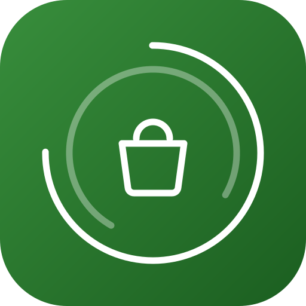
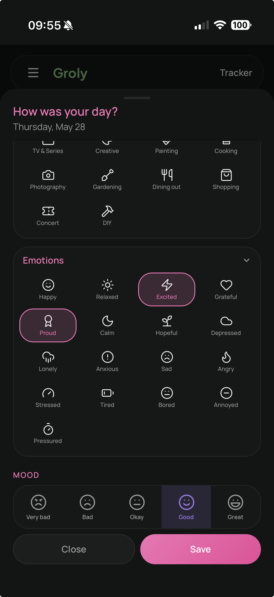
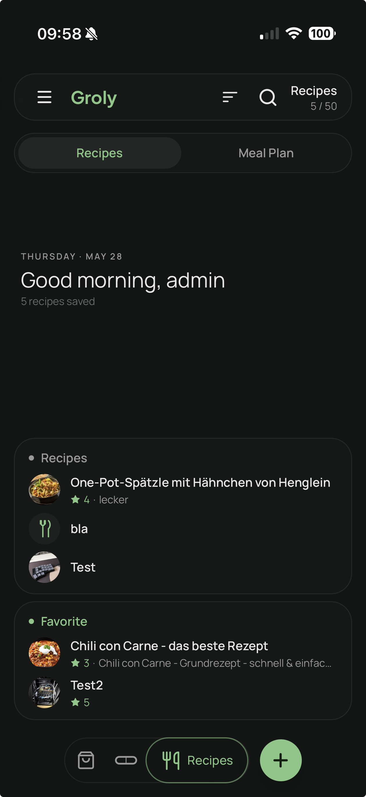
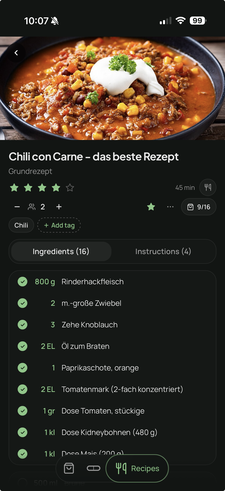

# Groly

<p align="center">
  
</p>

A mobile-first **grocery list, health & nutrition tracker, and meal planner** built for self-hosting — designed for your phone, not adapted to it. Every interaction is touch-optimized: bottom navigation, large tap targets, swipe gestures, and offline support so it works without signal in the store. Also fully usable in a desktop browser.

Groly is a **PWA (Progressive Web App)**. Install it to your home screen on iOS or Android to unlock the full experience: offline mode, push notifications, barcode scanner, and location-based list opening all require the installed PWA.

Self-hosted, runs as a lightweight Docker container. Ready for **Unraid** and any other Docker-based home server setup. Designed for families and small teams — no open registration, users are invited by the admin.

## Features

### Shopping Lists

<p align="center">
  
  
  
</p>

- **Shared lists** – Share lists with other users; changes sync in real time via Server-Sent Events.
- **Offline-first** – Add, check off, edit, and delete items without internet. Changes sync automatically when back online.
- **Barcode scan** – Scan product barcodes with your camera to add items directly to your list (iOS and Android). Uses the native [BarcodeDetector API](https://developer.mozilla.org/en-US/docs/Web/API/BarcodeDetector) where available (Chrome/Android) with [ZBar WASM](https://github.com/undecaf/zbar-wasm) as a fallback for iOS and Firefox. Product names are looked up via [Open Food Facts](https://world.openfoodfacts.org/), [Open Products Facts](https://world.openproductsfacts.org/), and [Open Beauty Facts](https://world.openbeautyfacts.org/) — open, community-maintained product databases covering food, household, and personal care items. No API key required. Lookups are routed through your server (user IPs are not exposed) and cached persistently in SQLite. An offline indicator is shown in the scanner when there is no internet connection.
- **Category sorting** – Items are automatically assigned a category based on keyword matching (e.g. "milk" → Dairy, "apple" → Fruit & Vegetables). The display order of categories can be customized in Settings to match your supermarket layout — globally or individually per list. Users can also override the category of any single item.
- **Quick entry** – Add multiple items at once by separating them with commas — e.g. `2x Milk, 500g Ground beef, Bread`. Quantities at the start of each item are recognized automatically.
- **Smart suggestions** – When adding items, previously used item names are suggested. Suggestions are tracked per user in a dedicated history table and ranked by usage frequency. Checked-off items older than 60 days are automatically removed from the database; suggestion history is retained for 6 months after last use.
- **Swipe to peek** – Swipe left or right on any item tile whose name is truncated to reveal the full name in an overlay, without accidentally checking it off.
- **Favourites** – Long-press an item and tap the star next to the quantity field to save it as a favourite. Favourited items are marked with a small green dot on their tile (can be turned off in Settings → Display). Open the favourites panel via + → Favourites to quickly re-add them to any list, sorted by category. Long-press a favourite card to remove it.

### Tracker

<p align="center">
  
  
  
  
</p>
<p align="center">
  
  
  
</p>
<p align="center">
  
  
</p>

A unified health & lifestyle tracker — supplements, water, caffeine, meditation, and mood — each with a quick-log sheet and day/week/month history.

- **Supplements** – Quick-log intake (amount + time, one tap). Define nutrients per unit (e.g. 500 µg B12 per capsule) and Groly sums your total daily intake. Track stock and reorder to any list via the cart button. Per-supplement push reminders, active/inactive toggle, optional brand & info.
- **Water** – Log with quick-add presets or a custom amount, set a daily goal (ml) with a fill bar, and schedule interval reminders within a time window.
- **Caffeine** – Log from a built-in drink catalog (10 drinks, per-user default amounts), set a daily limit with a fill bar (red when exceeded), and hide drinks you don't use.
- **Meditation** – Full-screen timer with quick-start presets or a custom duration, preparation phase, Zen progress animation, start/end sounds, daily goal, and optional reminders.
- **Mood** – Log daily mood on a 1–5 scale with an optional gratitude note and optional check-in reminder.
- **History & adherence** – Day, week, and month views for every tracker, with per-supplement adherence rates and heatmaps (scheduled vs. actually taken).
- **PDF export** – Export selected sections (supplements, trackers, mood, nutrients) for any period as a PDF to share with a doctor or trainer. [Example report](docs/pdf/example-report.pdf).

### Nutrition Tracker

<p align="center">
  
  
  
  
</p>
<p align="center">
  
  
</p>

A full food diary with calorie and macro tracking, built on the same [Open Food Facts](https://world.openfoodfacts.org/) integration as the barcode scanner.

- **Daily food diary** – Log meals across the day and see total calories plus protein, fat, carbs, and fiber as progress rings against your goal, with a per-meal and per-component breakdown.
- **Two food sources** – Search 160+ built-in generic foods (fruit, veg, grains, dairy, meat, …, bilingual), or look up any branded product by name or barcode via Open Food Facts — with image, nutrition values, and Nutri-Score. Lookups are cached in SQLite.
- **Daily goals** – Set calorie and macro targets manually, or let Groly estimate them from your sex, age, height, weight, and activity level (Mifflin-St Jeor).
- **Favorites** – Save single foods or whole meals (with photo) you log often and re-add them in one tap. A meal favorite can optionally be linked to a caffeine drink so logging it also logs caffeine.
- **From recipes** – Map a recipe's ingredients to nutrition data once; Groly then shows per-serving calories on the recipe and lets you track any number of servings straight into your food diary.
- **Units & thumbnails** – Track in grams, millilitres, or pieces (with per-piece weight); products and meals carry thumbnails for quick recognition.

### Recipes & Meal Planning

<p align="center">
  
  
  
</p>

- **Recipes** – Create and manage recipes, scale servings, and add ingredients directly to a shopping list. Import recipes from popular recipe websites by URL.
- **Weekly meal planner** – Plan meals for every day of the week. Assign recipes or free-text entries per day, adjust servings, and add ingredients from individual days or the entire week directly to a shopping list. Navigate forwards and backwards by week. Configurable as a quick access shortcut.

### Settings & Customization

<p align="center">
  
</p>

- **Feature flags** – Supplements, Trackers, and Recipes can be independently enabled or disabled per user in Settings → Display. Hide sections you don't use — they disappear from the navigation entirely.
- **Category sorting** – Customize the display order of categories globally or per list, to match your supermarket layout.
- **Quick access shortcuts** – Configure up to 4 shortcuts accessible by long-pressing the + button.
- **Favourite indicator** – The green dot on favourited items can be turned off per user.

### Notifications & Location

- **Push notifications** – Get notified when someone adds an item to a shared list, when a new app version is available, and for supplement reminders. Works on iOS (16.4+) and Android.
- **Location-based list opening** – Assign a location to any list (e.g. your supermarket). When you arrive within 100 meters, Groly automatically opens that list — no tapping required. Opt-in per user in Settings.

### Quick Access

- **Quick access shortcuts** – Long-press the + button to reveal up to 4 configurable shortcuts. Slide your finger to the desired shortcut and release to navigate — or release over empty space to cancel. Each shortcut can open a list, open a list with the add-item dialog, or jump straight into the barcode scanner. Configurable per user in Settings and synced across devices.

### App & Platform

<p align="center">
  
</p>

- **PWA** – Installable on iOS and Android, works like a native app.
- **Light & Dark mode** – Follows system preference automatically.
- **Multi-user** – Admin invites users via one-time link, resets passwords through the same mechanism, and manages list sharing invitations.
- **In-app changelog** – A "What's New" modal appears after each update and is always accessible from the menu.
- **i18n** – German and English.

## User Management

Groly does not have open registration — the admin creates accounts manually. This is by design for self-hosted instances where you control who has access.

**Adding users:**
1. Log in as admin
2. Open the menu (☰, top right)
3. Go to **Users**
4. Tap **Add User**, enter a username and role — no password needed
5. Copy or share the generated invite link with the new user
6. The user opens the link and sets their own password directly

Invite links are valid for 48 hours, are single-use, and can be regenerated by the admin at any time (the previous link is then invalidated). The same mechanism is used to reset a forgotten user password: open the user in the admin panel and tap **Reset password** to generate a fresh link.

Only admin accounts can invite users, reset passwords, and manage list sharing.

## HTTPS

**HTTPS is required.** Without it, the following features will not work:

| Feature | Why HTTPS is needed |
|---------|-------------------|
| **Offline mode** | Service workers only register over HTTPS (browser requirement) |
| **PWA installation** | Browsers only allow "Add to Home Screen" over HTTPS |
| **Push notifications** | The Web Push API is restricted to HTTPS |
| **Barcode scanner** | Camera access (`getUserMedia`) requires HTTPS |
| **Session cookies** | The session cookie uses the `Secure` flag in production |

### Getting HTTPS without a public domain

HTTPS is required for the PWA install, push notifications, and secure cookies. If you don't already have a domain pointed at your server, pick one of the options below. Listed from easiest to most flexible:

#### Tailscale — recommended for beginners
No domain, no router config, no certificate renewal. Tailscale gives every device a real hostname with a valid Let's Encrypt certificate. Free for up to 100 devices.
1. Install Tailscale on the host running Groly (native package, Docker container, or your platform's app store — see [tailscale.com/download](https://tailscale.com/download))
2. Enable HTTPS: Tailscale Admin → DNS → Enable HTTPS
3. Set `ORIGIN` to your Tailscale hostname, e.g. `https://my-server.tail-xxxxx.ts.net`

#### Cloudflare Tunnel
Zero-config HTTPS tunnel to your server, no port forwarding required. Free tier available. Useful if you already have a Cloudflare account or want a friendlier URL than the Tailscale one.

#### Reverse Proxy
Run Groly behind Nginx Proxy Manager, Caddy, or Traefik with your own domain and Let's Encrypt. Best fit if your server is already reachable from the internet and you have an existing reverse-proxy setup.

## Docker Deployment

The image is published to GitHub Container Registry and can be pulled directly:

```
ghcr.io/peterthepeter/groly:latest
```

### Docker Compose

```yaml
services:
  groly:
    image: ghcr.io/peterthepeter/groly:latest
    ports:
      - "3000:3000"
    volumes:
      - /mnt/user/appdata/groly:/app/data
    environment:
      - ADMIN_USERNAME=your-username
      - ADMIN_PASSWORD=secure-password
      - ORIGIN=https://your-domain.com
      # - ADDRESS_HEADER=X-Forwarded-For  # only set this when running behind a reverse proxy (Caddy, Nginx, Traefik)
      # - OFF_COUNTRY=germany  # optional: restrict nutrition product search to one country (default: worldwide)
      # Optional: push notifications (see Push Notifications section below)
      # - VAPID_PUBLIC_KEY=<publicKey>
      # - VAPID_PRIVATE_KEY=<privateKey>
      # - PUBLIC_VAPID_PUBLIC_KEY=<same publicKey>
      # - VAPID_SUBJECT=https://your-domain.com
    restart: unless-stopped
```

### Beta channel (optional)

Two image tags are published:

- `:latest` — stable releases. **Recommended for everyone.**
- `:beta` — pre-release builds for early testing. Opt-in only.

To help test upcoming changes, switch your image tag to `:beta`:

```yaml
    image: ghcr.io/peterthepeter/groly:beta
```

Everyone staying on `:latest` is unaffected by beta builds. To leave the beta channel, switch the tag back to `:latest` and pull again.

> **Back up your database before switching to `:beta`.** Beta builds may apply new database migrations that do not yet exist in `:latest`. Returning to `:latest` afterwards can fail if a newer migration has already run. The database lives in the `/app/data` volume — copy it somewhere safe first.

### Unraid

Install via **Community Applications** (search for "Groly") or add the template manually:

- **Template URL:** `https://raw.githubusercontent.com/peterthepeter/groly/main/unraid/groly.xml`
- **Repository:** `ghcr.io/peterthepeter/groly:latest`
- **Port:** `3000` (WebUI)
- **Path:** `/app/data` → e.g. `/mnt/user/appdata/groly`
- **Variables:** `ADMIN_USERNAME`, `ADMIN_PASSWORD`, `ORIGIN`
- **Push notifications (optional):** additionally set `VAPID_PUBLIC_KEY`, `VAPID_PRIVATE_KEY`, `PUBLIC_VAPID_PUBLIC_KEY`, `VAPID_SUBJECT` — see [Push Notifications](#push-notifications-optional) below

The volume `/app/data` contains the SQLite database. An admin user is created on first start with the credentials from `ADMIN_USERNAME` and `ADMIN_PASSWORD`. After the first start both variables can be safely deleted from the container — `ADMIN_PASSWORD` is never re-applied. If you ever forget your admin password, see [Admin password recovery](#admin-password-recovery) below.

> **File permissions:** The container runs as user `groly` (UID 1000, GID 1000). Make sure the host data directory is owned by this user:
> ```bash
> chown -R 1000:1000 /path/to/your/appdata/groly
> ```
> Existing installations upgrading from an older version must run this command once before restarting the container.

> **Architecture:** The Docker image is built for `linux/amd64`.

### Environment Variables

| Variable | Required | Description |
|----------|----------|-------------|
| `DATABASE_URL` | Yes | Path to the SQLite file, e.g. `/app/data/groly.db` |
| `ORIGIN` | Yes | Full URL of your instance, e.g. `https://groly.example.com` |
| `ADMIN_USERNAME` | First run only | Username for the initial admin account. After first start can be deleted, but must be present (with the original value) if you ever need to use `ADMIN_PASSWORD_RESET`. |
| `ADMIN_PASSWORD` | First run only | Password for the initial admin account. **Only used when no users exist yet.** Can — and should — be deleted from the container after first start. To reset a forgotten admin password, use `ADMIN_PASSWORD_RESET` instead. |
| `ADMIN_PASSWORD_RESET` | Emergency only | If set, resets the password of the user defined in `ADMIN_USERNAME` to this value on container start and invalidates all their existing sessions. Leave empty in normal operation — see [Admin password recovery](#admin-password-recovery). |
| `VAPID_PUBLIC_KEY` | Optional | VAPID public key for push notifications |
| `VAPID_PRIVATE_KEY` | Optional | VAPID private key for push notifications |
| `PUBLIC_VAPID_PUBLIC_KEY` | Optional | Same value as `VAPID_PUBLIC_KEY` |
| `VAPID_SUBJECT` | Optional | `https://` URL or `mailto:` address for VAPID |
| `ADDRESS_HEADER` | Optional | Set to `X-Forwarded-For` **only** when running behind a reverse proxy (Caddy, Nginx, Traefik). **Do not set this if you're accessing Groly directly** — it will cause login failures. Enables accurate per-client IP rate limiting. |
| `OFF_COUNTRY` | Optional | Restricts the nutrition tracker's Open Food Facts product search to a single country for more locally relevant results, e.g. `germany`, `france`, `switzerland`. Leave unset to search worldwide (default). |

### Admin password recovery

Forgot your admin password? Since Groly is self-hosted and has no email server, recovery is done through the container environment:

1. **Set the variable** `ADMIN_PASSWORD_RESET` in your container template to a new password (any string — it will become the new admin password).
2. Make sure `ADMIN_USERNAME` is still set to the username of the admin you want to reset (default `admin`).
3. **Restart the container.** On startup, Groly will reset that user's password and invalidate all their existing sessions. You will see a warning in the container logs.
4. **Log in** with the new password.
5. **Delete `ADMIN_PASSWORD_RESET`** from your container template. As long as it stays set, the password will be re-applied on every container restart.

This works only for the user named in `ADMIN_USERNAME` (the original admin). For any other admin or regular user who is locked out, log in as the original admin and use the "Reset password" button in the user management UI — it generates a fresh invite link you can send them.

### Push Notifications (optional)

Generate a VAPID key pair once:

```sh
node -e "const wp=require('web-push'); const k=wp.generateVAPIDKeys(); console.log(JSON.stringify(k,null,2))"
```

Add to your environment:

```yaml
environment:
  - VAPID_PUBLIC_KEY=<publicKey>
  - VAPID_PRIVATE_KEY=<privateKey>
  - PUBLIC_VAPID_PUBLIC_KEY=<same publicKey>
  - VAPID_SUBJECT=https://your-domain.com
```

**Important:**
- `VAPID_PUBLIC_KEY` and `PUBLIC_VAPID_PUBLIC_KEY` must be the **same value**.
- `VAPID_SUBJECT` must be a real `https://` URL or `mailto:` address — a `.local` domain will be rejected by Apple's push service.
- Generate the keys **once** and keep them. If the keys change, all existing subscriptions become invalid and users need to re-subscribe in Settings.

## Database Maintenance

Groly performs automatic cleanup daily — no manual intervention required:

| Data | Cleanup rule |
|------|-------------|
| Checked-off items | Deleted after 60 days |
| Item suggestions | Deleted after 6 months without use |
| Barcode cache | Deleted after 6 months without a lookup |
| Expired sessions | Deleted daily |
| Stale push subscriptions | Removed automatically on failed delivery (HTTP 410/404) |

Active data (lists, unchecked items, recipes, supplements, list members) is only removed by user action. For a typical self-hosted instance, the SQLite database stays well under 100 MB indefinitely.

## Tech Stack

| Layer | Technology |
|-------|-----------|
| Framework | SvelteKit (TypeScript, Svelte 5 Runes) |
| Database | SQLite via better-sqlite3 + Drizzle ORM |
| Auth | Custom (scrypt + sessions, 30-day expiry) |
| Real-time | Server-Sent Events (SSE) |
| Offline | Dexie.js (IndexedDB) + mutation queue |
| Push | Web Push API + VAPID (web-push) |
| Barcode | BarcodeDetector API + ZBar WASM (@undecaf/zbar-wasm) |
| PWA | vite-plugin-pwa + Workbox |
| CSS | Tailwind CSS v4 |
| i18n | Paraglide-SvelteKit |
| Deployment | Docker (Node.js adapter), linux/amd64 |

## Support

Groly is free, open, and built in my spare time. If it's useful to you and you'd like to say thanks, you can buy me a coffee — entirely voluntary, with nothing expected in return.

[](https://ko-fi.com/groly)
